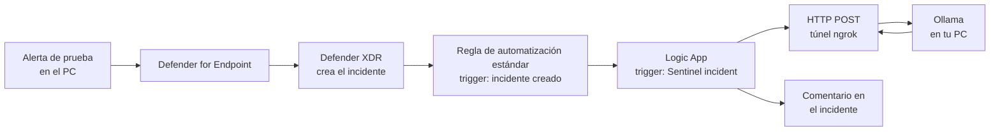

Laboratorio para que un incidente de Microsoft Defender / Microsoft Sentinel se envíe a un modelo de IA que corre **en tu propio PC** (Ollama) y el análisis vuelva como **comentario del incidente**.

> ⚠️ **Es un laboratorio, no una solución de producción.** 
> 
> La IA local se equivoca. Cada comentario debe revisarlo una persona.

**Convención:** los nombres de menús aparecen en español e inglés, porque el portal cambia según el idioma. Los valores entre `<...>` son los tuyos **(nunca publiques los reales)**.

## Qué hace y cómo funciona

Piezas:

| Pieza                            | Función                                                     |
| -------------------------------- | ----------------------------------------------------------- |
| Ollama                           | Ejecuta el modelo de IA en tu PC                            |
| ngrok                            | Da a Azure una URL pública hacia tu Ollama local            |
| Logic App (Consumption)          | Recibe el incidente, llama a Ollama y publica el comentario |
| Regla de automatización estándar | Lanza la Logic App cuando se crea un incidente              |

**Idea clave:** una regla de automatización solo puede lanzar playbooks cuyo trigger coincide con el suyo. Si la Logic App usa el trigger _Microsoft Sentinel incident_, la regla debe ser de tipo **"When incident is created"**. Si la regla es de alerta, tu Logic App no aparecerá en la lista.

